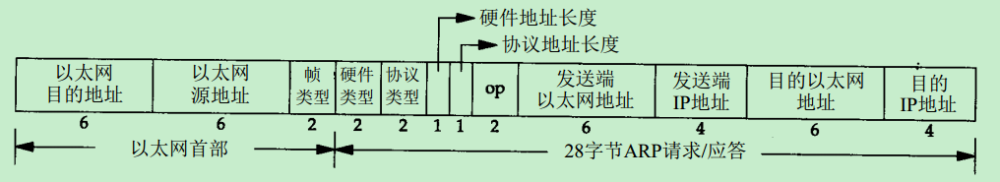

# ARP

链路层通信根据`48bit`以太网地址（硬件地址）来确定目的接口，而地址解析协议负责`32bit` `IP`地址与`48bit`以太网地址之间的映射：

- （1）`ARP`负责将`IP`地址映射到对应的硬件地址
- （2）`RARP`负责相反的过程，通常用于无盘系统。

## ARP高速缓存

`ARP`高效运行的关键是每台主机上都有一个`ARP`高速缓存，缓存中每一项的生存时间一般为20分钟，但不完整表项超时时间一般为3分钟（如192.168.13.254）。

```sh
# arp -a

? (192.168.0.16) at 00:1b:21:b9:9f:d4 [ether] on eth0
? (192.168.0.6) at 00:1b:21:b9:9f:d4 [ether] on eth0
? (192.168.13.233) at 00:16:3e:01:7a:b2 [ether] on eth0
? (192.168.13.254) at <incomplete> on eth0
```

可以通过`arp`命令来操作ARP高速缓存：

- `arp` 显示当前的`ARP`缓存列表。
- `arp -s ip mac` 添加静态ARP记录，如果需要永久保存，应该编辑`/etc/ethers`文件。
- `arp -f` 使`/etc/ethers`中的静态ARP记录生效。

## ARP分组格式



其中：

* `ARP`协议的帧类型为`0x0806`
* 硬件类型：1表示以太网地址
* 协议类型：`0x800`表示`IP`协议
* 硬件地址长度：值为6
* 协议地址长度：值为4
* `op`：1为`ARP`请求，2为`ARP`应答，3为`RARP`请求，4为`RARP`应答
* 对于`ARP`请求来说，目的端硬件地址为广播地址`FF:FF:FF:FF:FF:FF`），由`ARP`相应的主机填入。

一个完整ARP请求应答的抓包：

```sh
# tcpdump -e -p arp -n -vv
21:08:10.329163 00:16:3e:01:79:43 > ff:ff:ff:ff:ff:ff, ethertype ARP (0x0806), length 42: Ethernet (len 6), IPv4 (len 4), Request who-has 192.168.14.23 tell 192.168.13.43, length 28
21:08:10.329626 00:16:3e:01:7b:17 > 00:16:3e:01:79:43, ethertype ARP (0x0806), length 60: Ethernet (len 6), IPv4 (len 4), Reply 192.168.14.23 is-at 00:16:3e:01:7b:17, length 46
```

## ARP代理

当向位于不同网络的主机发送`ARP`请求时，由两个网络之间的路由器响应该`ARP`请求，这个过程称为`ARP`代理。

`ARP`代理也称为混合`ARP`：通过两个网络之间的路由器可以互相隐藏物理网络。

## 免费ARP

主机发送`ARP`请求查找自己的IP地址。通常有两个用途：

- （1）确认网络中是否有其他主机设置了相同的`IP`地址；
- （2）当主机的物理地址改变了，可以通过免费`ARP`更新更新路由器和其他主机中的高速缓存。

## RARP

1. `RARP`通常用于无盘系统，无盘系统从物理网卡上读到硬件地址后，发送一个`RARP`请求查询自己的`IP`地址。
2. `RARP`的协议格式：与`ARP`协议一致，只不过帧类型代码为`0x8035`
3. `RARP`使用链路层广播，这样阻止了大多数路由器转发`ARAP`请求，只返回很小的信息，即`IP`地址。

## 参考

- [地址解析协议 (ARP)](https://zh.wikipedia.org/wiki/%E5%9C%B0%E5%9D%80%E8%A7%A3%E6%9E%90%E5%8D%8F%E8%AE%AE)
- [ARP协议揭密](https://www.ibm.com/developerworks/cn/linux/l-arp/index.html)
- [TCP/IP协议详解卷一 -- ARP：地址解析协议](https://www.kancloud.cn/lifei6671/tcp-ip/139994)
