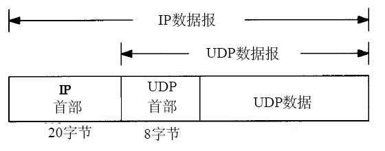
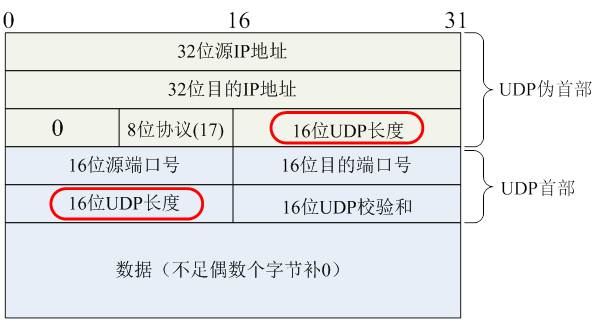
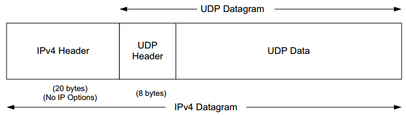

# UDP

`UDP`是一种对象数据报的传输层协议，它不提供可靠性，其数据报被封装在`IP`数据报中，封装格式如下图所示：

首部格式为

* 源端口号和目的端口号分表表示了发送进程和接收进程
* `UDP`长度字段包括了`UDP`首部和`UDP`数据的字节长度
* `UDP`检验和覆盖了`UDP`首部和`UDP`数据（`IP`首部检验和只覆盖了`IP`首部，不覆盖数据报中的任何数据）
* `UDP`数据报的长度可以为奇数字节，但是检验和算法是把若干个`16bit`字相加。解决方法是必要时在最后增加填充字节0，

这只是为了检验和的计算。`UDP`数据报和`TCP`段都包含一个12字节长的伪首部，它是为了计算检验和而设置的。伪首部包含`IP`首部一些字段。

## IP分片

以太网和`802.3`对数据帧的长度都有一个限制，其最大值分别是`1500`和`1492`个字节。链路层的这个特性称作`MTU`。不同类型的网络大多数都有一个上限。如果IP层有一个数据要传，且数据的长度比链路层的`MTU`还大，那么`IP`层就要进行分片（`fragmentation`），把数据报分成若干片，这样每一个分片都小于`MTU`。当`IP`数据报被分片后，每一片都成为一个分组，具有自己的`IP`首部，并在选择路由时与其他分组独立。

把一份`IP`数据报进行分片以后，由到达目的端的`IP`层来进行重新组装，其目的是使分片和重新组装过程对运输层（`TCP/UDP`）是透明的。由于每一分片都是一个独立的包，当这些数据报的片到达目的端时有可能会失序，但是在`IP`首部中有足够的信息让接收端能正确组装这些数据报片。

尽管`IP`分片过程看起来透明的，但有一点让人不想使用它：即使只丢失一片数据也要重新传整个数据报。

why？因为`IP`层本身没有超时重传机制------由更高层（比如`TCP`）来负责超时和重传。当来自`TCP`报文段的某一片丢失后，`TCP`在超时后会重发整个TCP报文段，该报文段对应于一份`IP`数据报（而不是一个分片），没有办法只重传数据报中的一个数据分片。

使用`UDP`很容易导致`IP`分片，`TCP`试图避免`IP`分片。那么`TCP`是如何试图避免`IP`分片的呢？其实说白了，采用`TCP`协议进行数传输是不会造成`IP`分片的，因为一旦`TCP`数据过大，超过了`MSS`，则在传输层会对`TCP`包进行分段（如何分，见下文！），自然到了`IP`层的数据报肯定不会超过`MTU`，当然也就不用分片了。而对于`UDP`数据报，如果`UDP`组成的IP数据报长度超过了`1500`，那么`IP`数据报显然就要进行分片，因为`UDP`不能像`TCP`一样自己进行分段。

`MSS`（`Maxitum Segment Size`）最大分段大小的缩写，是`TCP`协议里面的一个概念

* 1）`MSS`就是TCP数据包每次能够传输的最大数据分段。为了达到最佳的传输效能`TCP`协议在建立连接的时候通常要协商双方的`MSS`值，这个值`TCP`协议在实现的时候往往用`MTU`值代替（需要减去`IP`数据包包头的大小`20Bytes`和`TCP`数据段的包头`20Bytes`）所以往往`MSS`为`1460`。通讯双方会根据双方提供的`MSS`值得最小值确定为这次连接的最大MSS值。

* 2）相信看到这里，还有最后一个问题：`TCP`是如何实现分段的呢？其实`TCP`无所谓分段，因为每个`TCP`数据报在组成前其大小就已经被`MSS`限制了，所以`TCP`数据报的长度是不可能大于`MSS`的，当然由它形成的IP包的长度也就不会大于`MTU`，自然也就不用`IP`分片了。

* 发生`ICMP`不可达差错的另一种情况是，当路由器收到一份需要分片的数据报，而在`IP`首部又设置了不分片（`DF`）的标志比特。如果某个程序需要判断到达目的端的路途中最小`MTU`是多少—称作路径`MTU`发现机制，那么这个差错就可以被该程序使用。
* 理论上，`UDP`数据的最大长度为：`65535-20`字节`IP`首部长度`-8`字节`UDP`首部长度=`65507`。但是大多是实现都比这个值小，主要是受限于`socket`接口以及`TCP/IP`内核的限制。大部分系统都默认提供了可读写大于`8192`字节的`UDP`数据报。
* 当目标主机的处理速度赶不上数据接收的速度，因为接受主机的`IP`层缓存会被占满，所以主机就会发出一个`ICMP`源站抑制差错报文。

## 参考

- [User Datagram Protocol](https://en.wikipedia.org/wiki/User_Datagram_Protoco)
- [UDP - IETF](https://www.ietf.org/rfc/rfc768.txt)
