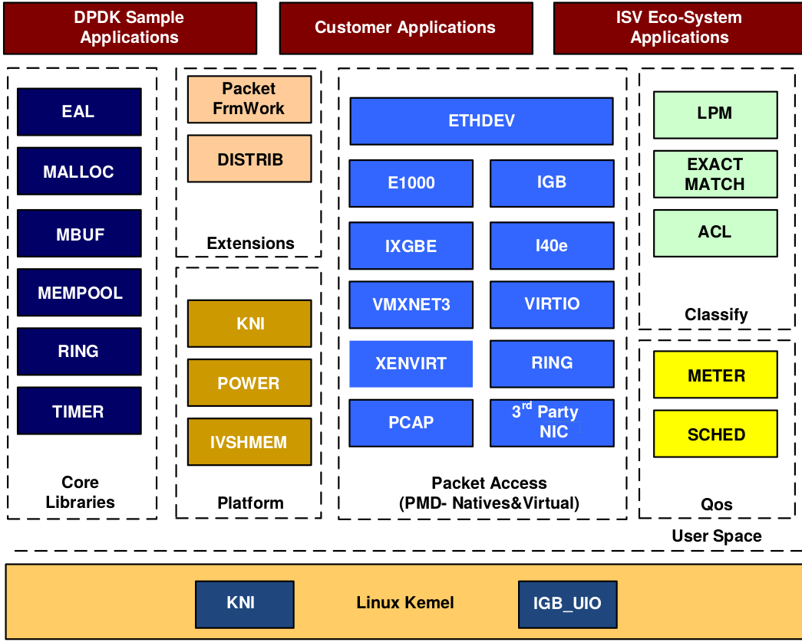
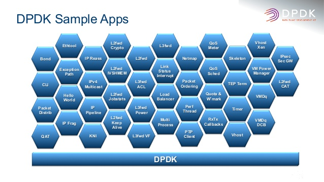

# DPDK

`Intel DPDK`全称`Intel Data Plane Development Kit`，是`intel`提供的数据平面开发工具集，为`Intel architecture（IA）`处理器架构下用户空间高效的数据包处理提供库函数和驱动的支持，它不同于`Linux`系统以通用性设计为目的，而是专注于网络应用中数据包的高性能处理。`DPDK`应用程序是运行在用户空间上利用自身提供的数据平面库来收发数据包，绕过了`Linux`内核协议栈对数据包处理过程。`Linux`内核将`DPDK`应用程序看作是一个普通的用户态进程，包括它的编译、连接和加载方式和普通程序没有什么两样。`DPDK`程序启动后只能有一个主线程，然后创建一些子线程并绑定到指定`CPU`核心上运行。

## 基本组件

> 图片来源[Architecture Overview - dpdk.org](http://dpdk.org/doc/guides/prog_guide/overview.html#core-components)

-   `EAL`（`Environment Abstraction Layer`）即环境抽象层，为应用提供了一个通用接口，隐藏了与底层库与设备打交道的相关细节。`EAL`实现了`DPDK`运行的初始化工作，基于大页表的内存分配，多核亲缘性设置，原子和锁操作，并将`PCI`设备地址映射到用户空间，方便应用程序访问。
-   `Buffer Manager API`通过预先从`EAL`上分配固定大小的多个内存对象，避免了在运行过程中动态进行内存分配和回收来提高效率，常常用作数据包`buffer`来使用。
-   `Queue Manager API`以高效的方式实现了无锁的`FIFO`环形队列，适合与一个生产者多个消费者、一个消费者多个生产者模型来避免等待，并且支持批量无锁的操作。
-   `Flow Classification API`通过`Intel SSE`基于多元组实现了高效的`hash`算法，以便快速的将数据包进行分类处理。该API一般用于路由查找过程中的最长前缀匹配中，安全产品中根据Flow五元组来标记不同用户的场景也可以使用。
-   `PMD`则实现了Intel `1GbE`、`10GbE`和`40GbE`网卡下基于轮询收发包的工作模式，大大加速网卡收发包性能。

`DPDK`核心思想：

- `PMD`: `DPDK`针对`Intel`网卡实现了基于轮询方式的`PMD`（`Poll Mode Drivers`）驱动，该驱动由`API`、用户空间运行的驱动程序构成，该驱动使用无中断方式直接操作网卡的接收和发送队列（除了链路状态通知仍必须采用中断方式以外）。目前`PMD`驱动支持`Intel`的大部分`1G`、`10G`和`40G`的网卡。`PMD`驱动从网卡上接收到数据包后，会直接通过`DMA`方式传输到预分配的内存中，同时更新无锁环形队列中的数据包指针，不断轮询的应用程序很快就能感知收到数据包，并在预分配的内存地址上直接处理数据包，这个过程非常简洁。如果要是让`Linux`来处理收包过程，首先网卡通过中断方式通知协议栈对数据包进行处理，协议栈先会对数据包进行合法性进行必要的校验，然后判断数据包目标是否本机的socket，满足条件则会将数据包拷贝一份向上递交给用户`socket`来处理，不仅处理路径冗长，还需要从内核到应用层的一次拷贝过程。
- `hugetlbfs`: 这样有两个好处：第一是使用`hugepage`的内存所需的页表项比较少，对于需要大量内存的进程来说节省了很多开销，像`oracle`之类的大型数据库优化都使用了大页面配置；第二是TLB冲突概率降低，`TLB`是`cpu`中单独的一块高速`cache`，采用`hugepage`可以大大降低`TLB miss`的开销。`DPDK`目前支持了`2M`和`1G`两种方式的`hugepage`。通过修改默认`/etc/grub.conf`中`hugepage`配置为“`default\_hugepagesz=1G    hugepagesz=1G hugepages=32 isolcpus=0-22`”，然后通过`mount –t hugetlbfs nodev /mnt/huge`就将`hugepage`文件系统`hugetlbfs`挂在/`mnt/huge`目录下，然后用户进程就可以使用`mmap`映射`hugepage`目标文件来使用大页面了。测试表明应用使用大页表比使用`4K`的页表性能提高`10%\~15%`。
- `CPU`亲缘性:多核则是每个`CPU`核一个线程，核心之间访问数据无需上锁。为了最大限度减少线程调度的资源消耗，需要将`Linux`绑定在特定的核上，释放其余核心来专供应用程序使用。同时还需要考虑`CPU`特性和系统是否支持`NUMA`架构，如果支持的话，不同插槽上`CPU`的进程要避免访问远端内存，尽量访问本端内存。
- 减少内存访问:少用数组和指针，多用局部变量；少用全局变量；一次多访问一些数据；自己管理内存分配；进程间传递指针而非整个数据块
- `Cache`有效性得益于空间局部性（附近的数据也会被用到）和时间局部性（今后一段时间内会被多次访问）原理，通过合理的使用`cache`，能够使得应用程序性能得到大幅提升
- 避免`False Sharing`: 多核`CPU`中每个核都拥有自己的`L1/L2 cache`，当运行多线程程序时，尽管算法上不需要共享变量，但实际执行中两个线程访问同一`cache line`的数据时就会引起冲突，每个线程在读取自己的数据时也会把别人的`cache line`读进来，这时一个核修改改变量，`CPU`的`cache`一致性算法会迫使另一个核的`cache`中包含该变量所在的`cache line`无效，这就产生了`false sharing`（伪共享）问题. `Falsing sharing`会导致大量的`cache`冲突，应该尽量避免。访问全局变量和动态分配内存是`false sharing`问题产生的根源，当然访问在内存中相邻的但完全不同的全局变量也可能会导致`false sharing`，多使用线程本地变量是解决`false sharing`的根源办法。
- 内存对齐：根据不同存储硬件的配置来优化程序，性能也能够得到极大的提升。在硬件层次，确保对象位于不同`channel`和`rank`的起始地址，这样能保证对象并并行加载。
- 字节对齐：众所周知，内存最小的存储单元为字节，在32位CPU中，寄存器也是32位的，为了保证访问更加高效，在32位系统中变量存储的起始地址默认是4的倍数（64位系统则是8的倍数），定义一个32位变量时，只需要一次内存访问即可将变量加载到寄存器中，这些工作都是编译器完成的，不需人工干预，当然我们可以使用`\_\_attribute\_\_((aligned(n)))`来改变对齐的默认值。
- `cache`对齐，这也是程序开发中需要关注的。`Cache line`是`CPU`从内存加载数据的最小单位，一般`L1 cache`的`cache line`大小为64字节。如果`CPU`访问的变量不在`cache`中，就需要先从内存调入到`cache`，调度的最小单位就是`cache line`。因此，内存访问如果没有按照`cache line`边界对齐，就会多读写一次内存和`cache`了。
- `NUMA`: `NUMA`系统节点一般是由一组`CPU`和本地内存组成。`NUMA`调度器负责将进程在同一节点的CPU间调度，除非负载太高，才迁移到其它节点，但这会导致数据访问延时增大。
- 减少进程上下文切换: 需要了解哪些场景会触发`CS`操作。首先就介绍的就是不可控的场景：进程时间片到期；更高优先级进程抢占`CPU`。其次是可控场景：休眠当前进程(`pthread\_cond\_wait`)；唤醒其它进程(`pthread\_cond\_signal`)；加锁函数、互斥量、信号量、`select`、`sleep`等非常多函数都是可控的。对于可控场景是在应用编程需要考虑的问题，只要程序逻辑设计合理就能较少`CS`的次数。对于不可控场景，首先想到的是适当减少活跃进程或线程数量，因此保证活跃进程数目不超过`CPU`个数是一个明智的选择；然后有些场景下，我们并不知道有多少个活跃线程的时候怎么来保证上下文切换次数最少呢？这是我们就需要使用线程池模型：让每个线程工作前都持有带计数器的信号量，在信号量达到最大值之前，每个线程被唤醒时仅进行一次上下文切换，当信号量达到最大值时，其它线程都不会再竞争资源了。
- 分组预测机制，如果预测的一个分支指令加入流水线，之后却发现它是错误的分支，处理器要回退该错误预测执行的工作，再用正确的指令填充流水线。这样一个错误的预测会严重浪费时钟周期，导致程序性能下降。《计算机体系结构：量化研究方法》指出分支指令产生的性能影响为`10%\~30%`，流水线越长，性能影响越大。`Core i7`和`Xen`等较新的处理器当分支预测失效时无需刷新全部流水，当错误指令加载和计算仍会导致一部分开销。分支预测中最核心的是分支目标缓冲区（`Branch Target Buffer`，简称`BTB`），每条分支指令执行后，都会`BTB`都会记录指令的地址及它的跳转信息。`BTB`一般比较小，并且采用`Hash`表的方式存入，在`CPU`取值时，直接将PC指针和`BTB`中记录对比来查找，如果找到了，就直接使用预测的跳转地址，如果没有记录，必须通过`cache`或内存取下一条指令。
-   利用流水线并发: 像`Pentium`处理器就有`U/V`两条流水，并且可以独自独立读写缓存，循环2可以将两条指令安排在不同流水线上执行，性能得到极大提升。另外两条流水线是非对称的，简单指令（`mpv,add,push,inc,cmp,lea`等）可以在两条流水上并行执行、位操作和跳转操作并发的前提是在特定流水线上工作、而某些复杂指令却只能独占`CPU`。
-  为了利用空间局部性，同时也为了覆盖数据从内存传输到`CPU`的延迟，可以在数据被用到之前就将其调入缓存，这一技术称为预取`Prefetch`，加载整个`cache`即是一种预取。`CPU`在进行计算过程中可以并行的对数据进行预取操作，因此预取使得数据/指令加载与`CPU`执行指令可以并行进行。

## 架构

> 图片来源[DPDK 初探](https://www.linuxwind.com/2017/05/12/dpdk.html)

在最底部的内核态(`Linux Kernel`)`DPDK` 有两个模块:`KNI` 与 `IGB\_UIO`。 其中,`KNI`提供给用户一个使用 `Linux` 内核态的协议栈,以及传统的 Linux网络工具(如`ethtool`, `ifconfig`)。`IGB\_UIO`(`igb\_uio.ko` 和 `kni.ko.IGB\_UIO`)则借助了 `UIO` 技术,在初始化过程中将网卡硬件寄存器映射到用户态。

`DPDK` 的上层用户态由很多库组成,主要包括核心部件库(`Core Libraries`)、平台相关模块(`Platform`)、网卡轮询模式驱动模块(`PMD-Natives&Virtual`)、`QoS`库、报文转发分类算法(`Classify`)等几大类,用户应用程序可以使用这些库进行二次开发.

## 应用

> 图片来源[DPDK: Multi Architecture High Performance Packet Processing](https://www.slideshare.net/MichelleHolley1/dpdk-multi-architecture-high-performance-packet-processing-72911726)

- [SPDK](http://www.spdk.io/)
- [OPNFV](https://wiki.opnfv.org/)
- [Open vSwitch for NFV](https://wiki.opnfv.org/display/ovsnfv/Open+vSwitch+For+NFV+Home)
- [Data Plane Acceleration (DPACC)](https://wiki.opnfv.org/display/dpacc/DPACC+Home)
- [OVS-DPDK](ovs-dpdk.html)
- [VPP](http://fd.io)和[TLDK](https://wiki.fd.io/view/TLDK)
- [Seastar](http://www.seastar-project.org)：TCP/IP协议栈的实现只适合在内网运行，公网复杂的网络环境会导致它出现各种问题
- [F-Stack](http://www.f-stack.org/)：粘合了DPDK,FreeBSD协议栈，POSIX API，同时支持coroutine

## 参考

> 注: 本章内容大部分整理自《[深入浅出DPDK](https://www.amazon.cn/%E5%9B%BE%E4%B9%A6/dp/B01FQ9SMZO)》的读书笔记。

- 《[深入浅出DPDK](https://www.amazon.cn/%E5%9B%BE%E4%B9%A6/dp/B01FQ9SMZO)》
- [dpdk.org](http://dpdk.org)
- [DPDK documentation - dpdk.org](http://dpdk.org/doc/guides/)
- [Data Plane Development Kit (DPDK)](http://intel.com/go/dpdk)
- [FD.io - The Fast Data Project The Universal Dataplane](https://fd.io)
- [fd.io Developer Wiki](https://wiki.fd.io/view/Main_Page)
- [lagopus/lagopus](https://github.com/lagopus/lagopus)
- [Data Plane Performance Demonstrators (DPPD)](https://01.org/zh/intel-data-plane-performance-demonstrators?langredirect=1)
- [DPDK Summit - 08 Sept 2014 - Intel - Networking Workloads on Intel Architecture](https://www.slideshare.net/jstleger/6-dpdk-summit-2014-intel-presentation-venky-venkatesan)
- [Getting Started Guide for Linux](https://www.intel.com/content/dam/www/public/us/en/documents/guides/dpdk-getting-started-guide.pdf)
- [DPDK: Multi Architecture High Performance Packet Processing](https://www.slideshare.net/MichelleHolley1/dpdk-multi-architecture-high-performance-packet-processing-72911726)
