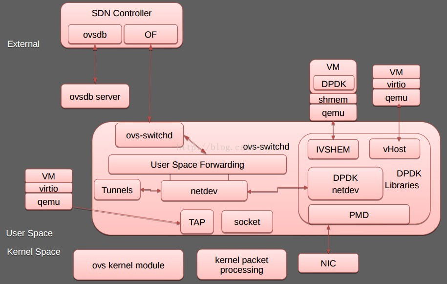

# DPDK Ring and ivshmem

## DPDK Ring

`DPDK Ring`提供了一个`FIFO`无锁队列，支持丰富的队列操作，比如

- Multi-consumer or single-consumer dequeue
- Multi-producer or single-producer enqueue
- Bulk dequeue - Dequeues the specified count of objects if successful; otherwise fails
- Bulk enqueue - Enqueues the specified count of objects if successful; otherwise fails
- Burst dequeue - Dequeue the maximum available objects if the specified count cannot be fulfilled
- Burst enqueue - Enqueue the maximum available objects if the specified count cannot be fulfilled


> 图片来源[Ring Library - dpdk.org](http://dpdk.org/doc/guides/prog_guide/ring_lib.html)

## ivshmem

`ivshmem`则通过把内存映射成虚拟机PCI设备提供了虚拟机间(`host-to-guest or guest-to-guest`)共享内存的机制。


> 图片来源[DPDK IVSHMEM Library](http://dpdk.org/doc/guides-16.04/prog_guide/ivshmem_lib.html)

DPDK `ivshmem`:


> 图片来源[使用OVS DPDK (by quqi99)](http://blog.csdn.net/quqi99/article/details/51087955)

### ivshmem使用示例

```sh
# on the host
mount tmpfs /dev/shm -t tmpfs -osize=32m
ivshmem_server -m 64 -p/tmp/nahanni &

# start VM
qemu-system-x86_64  -hda mg -L /pc-bios/ --smp 4 –chardev socket,path=/tmp/nahanni,id=nahanni-device ivshmem,chardev=nahanni,size=32m,msi=off -serial telnet:0.0.0.0:4000,server,nowait,nodelay-enable-kvm&

# inside VM
modprobe kvm_ivshmem
cat/proc/devices | grep kvm_ivshmem
mknod-mode=666 /dev/ivshmem c 245 0
```

**参考文档**

- [DPDK Ring Library](http://dpdk.org/doc/guides/prog_guide/ring_lib.html)
- [DPDK IVSHMEM Library](http://dpdk.org/doc/guides-16.04/prog_guide/ivshmem_lib.html)
- [Accelerating the Path to the Guest](http://slideplayer.com/slide/4900352/)
- [DPDK Summit - 08 Sept 2014 - VMware and Intel - Using DPDK In A Virtual World](https://www.slideshare.net/jstleger/7-dpdk-summit-2014-v-mwareintel-virtualization)
