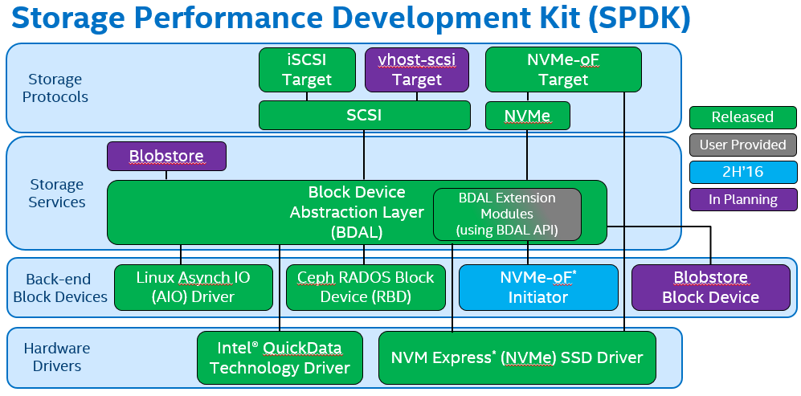

# SPDK

## 简介

`SPDK`全称`Storage Performance Development Kit`(高性能存储开发包)，它把驱动程序尽可能都放到用户态，同时采用了轮询模式，这样消除了`Kernel`进程之间的切换和中断处理，用这种方法达到高性能。

> 图片来源[Introduction to the Storage Performance Development Kit (SPDK)](https://software.intel.com/en-us/articles/introduction-to-the-storage-performance-development-kit-spdk)

为了帮助存储`OEM`（设备代工厂）和`ISV`（独立软件开发商）整合硬件，`Intel`构造了一系列驱动，以及一个完善的、端对端的参考存储体系结构，被命名为`Storage Performance Development Kit（SPDK）`。`SPDK`的目标是通过同时使用`Intel`的网络技术，处理技术和存储技术来提高突出显著的效率和性能。通过运行为硬件设计的软件，`SPDK`已经证明很容易达到每秒钟数百万次`I/O`读取，通过使用许多处理器核心和许多`NVMe`驱动去存储，而不需要额外卸载硬件。`Intel`在[BSD license](https://github.com/spdk/spdk/blob/master/LICENSE)许可协议下通过[Github](https://github.com/spdk)分发提供其全部的`Linux`参考架构的源代码。博客、邮件列表和额外文档可以在[spdk.io](http://www.spdk.io/)中找到。

> 图片来源[NVMeDirect：超越SPDK](http://www.ssdfans.com/nvmedirect%EF%BC%9A%E8%B6%85%E8%B6%8Aspdk1/3/)

## Libuns系统架构

**Libuns的TCP/UDP/IP协议栈**

## 用户态NVMe

## iSCSI target

## 参考

- [Introduction to the Storage Performance Development Kit (SPDK)](https://software.intel.com/en-us/articles/introduction-to-the-storage-performance-development-kit-spdk)
- [SPDK简介](http://aidaiz.com/spdk/)
- [NVMeDirect：超越SPDK](http://www.ssdfans.com/nvmedirect%EF%BC%9A%E8%B6%85%E8%B6%8Aspdk1/3/)
