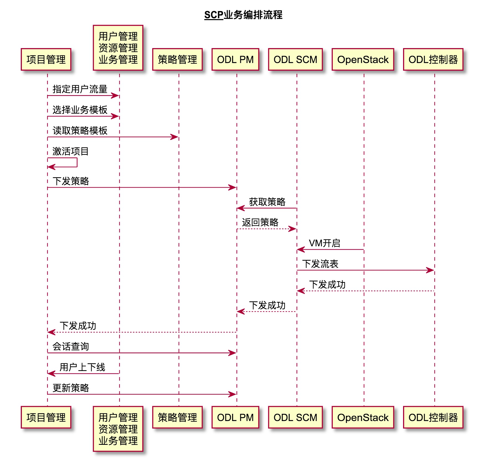
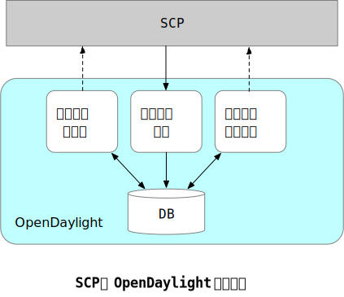

# 业务控制平台 (Service control Platform, SCP)

SCP是处于网络边缘业务技术方案的业务控制层，负责管理接入用户的业务定制、业务策略、基础资源监控、运营支撑系统接口等功能。

## SCP参考架构

在本方案中，SCP提供业务定制、用户管理以及资源管理等功能，提供与OSS、AAA等运营支撑系统的接口，提供ODL控制器层、OpenStack资源管理成的对接能力。


## SCP模块说明

1. 项目管理(Projects) : 管理用户和业务的捆绑关系，实现业务控制能力和业务策略向资源需求的映射，提供项目激活和去激活的操作界面。
2. 用户管理(Subscriber): 管理用户（资源使用者），提供所有接入用户的SLA配置及用户组定义功能，实现同步用户上下线状态。
3. 业务管理(Service) : 管理业务与业务模板，通过封装给中策略，实现各类负责业务配置界面和抽象处理能力管理配置。
4. 策略管理(Policy) : 管理策略与组策略，提供基本转发策略、带宽策略、业务策略、PF策略等配置功能。
5. 资源池管理(Resource) ： 管理资源池，提供全局业务链资源模型、全局资源视图，包括技术资源、VNF状态、物理/虚拟网络资源状态。
6. 系统监控(Monitor) : 监控资源池，通过主机上安装`NETCONF`代理实现实时监控，提供资源池的各类资源的实时状态监控和历史记录。
7. 基础配置(System Config) : 管理基础配置，提供设施配置、OSS接口配置、系统语言配置以及系统用户权限管理。
8. Web使用平台(Web Portal): 提供用户在线定制各种功能的接口，与AAA服务器以及用户管理模块共同完成。


## SCP业务流程编排



SCP的业务编排流程涉及整个方案中的插件交互。

1. 在创建项目之前，必须进行一系列的配置，包括用户组定义或导入(用户管理模块)、策略及其模板(策略管理模块)、业务及其模板(业务管理模块)、资源中的虚拟网络以及VM(资源管理模块)等。
2. 在创建项目时，需要绑定用户组、资源组以及业务套餐。即表示绑定的用户会按照订购的业务套餐，在资源池上分配相应的资源。例如订购在线杀毒服务的用户组的网络流量会引导至提供杀毒服务的VM，其服务链路径由业务套餐决定。
3. 在创建项目之后，需要激活相关的项目，策略才能真正生效。项目成功激活后，SCP将从BRAS监听到用户组内的用户状态，并监控会话的变化：用户上线会产生新的会话，用户下线将会删除相应的会话。

## 系统接口



### 添加策略

- URL

```bash
http://localhost:port/controller/nb/v2/policites
```

- HTTP Method :

```bash
POST
```

- HTTP Body :

```json
{
    "5tuple_v4":{       //用户的五元组信息
        "src_net":"",   //源IP地址
        "src_port":"-", //源端口
        "protocol":"-", //协议
        "dst_port":"-", //目的IP地址
        "dst_net":"-"   //目的端口
    },
    "PolicyList":[]     //策略数据
}
```

### 删除数据

- URL

```http
http://localhost:port/controller/nb/v2/policites
```


- HTTP Method :

```bash
DELETE
```

- HTTP Body :

```json
{
    "_id":"",   //会话ID
    "5tuple_v4":{       //用户的五元组信息
        "src_net":"",   //源IP地址
        "src_port":"-", //源端口
        "protocol":"-", //协议
        "dst_port":"-", //目的IP地址
        "dst_net":"-"   //目的端口
    }
}
```

## 资源监控

在SCP中，资源监控模块主要管理物理、虚拟服务器或设备的运行状态，为VNF资源的弹性伸缩提供原始数据，包括资源数据统计和资源预警设置。

- 提供7x24h不间断的监控，监控力度为1 min
- 资源数据统计，可以通过图表查询最近60min、最近24h、最近7天、最近30天的监控数据
- 监控项包含内存、磁盘没间隔时间流出的流量


资源监控模块采用`NETCONF`协议采集资源状态，通过给每天主机或虚拟机安装`NETCONF`代理，采集器定时访问代理，从代理读取状态信息，最后保存到数据库中，从而采集资源的使用情况。

### 资源监控采集流程


### 资源监控采集模块


