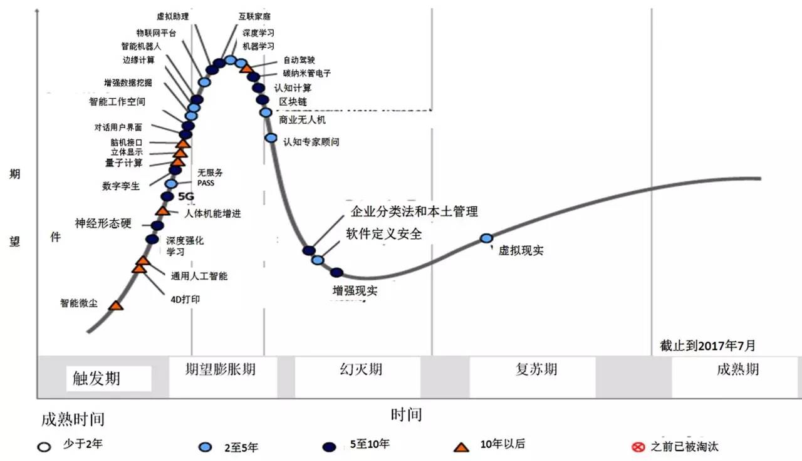

# SDN

2017年7月，Gartner公司发布了[年度新兴技术成熟度曲线](http://www.sohu.com/a/162408451_473283)。Gartner认为，2017年技术成熟度曲线揭示了未来5-10年的三方面技术趋势。

## 参考

1. [DNA开发者最佳实践](https://www.cisco.com/c/dam/assets/global/CN/pdfs/innovation/en_dnadeveloperbestpracticesharing_ppt_sc.pdf)
1. [ODL深度开发](https://afu.gitbooks.io/odl/content/)
