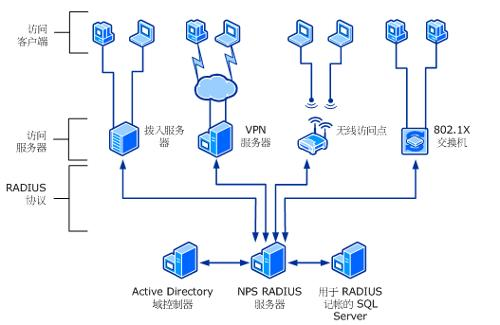

# RADIUS

## 简介

`RADIUS`的全称是`Remote Authentication Dial in User Service`,翻译过来是“远程用户拨号认证系统”。


> 常见Radius结构

## RADIUS和AAA

`RADIUS`是由[RFC2865](https://tools.ietf.org/html/rfc2865)，[RFC2866](https://tools.ietf.org/html/rfc2866)来定义的，是目前应用最广泛的`AAA`协议。

`RADIUS`是一种`C/S`结构的协议，他的客户端最初就是`NAS`(`Net Access Server`)服务器，现在任何运行`RADIUS`客户端的软件的计算机都可以成为`RADIUS`的客户端。

如果 `NAS` 收到用户连接请求，它会将它们传递到指定的 `RADIUS` 服务器，后者对用户进行验证，并将用户的配置信息返回给 `NAS`。然后，`NAS` 接受或拒绝连接请求。
`RADIUS`协议认证机制灵活，功能完整的 `RADIUS` 服务器可以支持很多不同的用户验证机制，除了 `LDAP` 以外，还包括：

- `PAP`（`Password Authentication Protocol`，密码验证协议，与 `PPP` 一起使用，在此机制下，密码以明文形式被发送到客户机进行比较）；
- `CHAP`（`Challenge Handshake Authentication Protocol`，挑战握手验证协议，比 `PAP` 更安全，它同时使用用户名和密码）；
- 本地 `UNIX/Linux` 系统密码数据库（`/etc/passwd`）；
- 其他本地数据库。

> 通过Radius和LDAP组合进行认证


在 `RADIUS` 中，验证和授权是组合在一起的。如果发现了用户名，并且密码正确，那么 `RADIUS` 服务器将返回一个 `Access-Accept` 响应，其中包括一些参数（属性-值对），以保证对该用户的访问。这些参数是在 `RADIUS` 中配置的，包括访问类型、协议类型、用户指定该用户的 `IP` 地址以及一个访问控制列表（`ACL`）或要在 `NAS` 上应用的静态路由，另外还有其他一些值。

`RADIUS` 记帐特性（在 [RFC 2866](https://tools.ietf.org/html/rfc2866) 中定义）允许在连接会话的开始和结束发送数据，表明在会话期间使用的可能用于安全或开单（`billing`）需要的大量资源 —— 例如时间、包和字节。


`RADIUS`是一种可扩展的协议，它进行的全部工作都是基于`Attrbiute-Length-Value`的向量进行的。`RADIUS`也支持厂家专有属性。

`IEEE`提出了`802.1x`标准，这是基于端口的标准，用于对无线网络的接入认证，在认证时，也是采用了`RADIUS`协议。

## 基本工作原理

### 认证过程

1. 用户接入`NAS`，`NAS`向`RADIUS`服务器使用`Access-Request`数据包提交用户信息 ，包括用户名、密码等相关信息，其中用户密码是经过`MD5`加密的，双方使用共享密钥，这个密钥不经过网络传播
1. `RADIUS`服务器对用户名和密码进行校验，必要时可以提出一个`Challenge`，要求进一步对用户认知，也可以对`NAS`进行类似认证；如果合法，给`NAS`返回`Access-Accept`数据包，允许用户进行下一步工作，否则返回`Access-Reject`数据包，拒绝用户访问；
1. 如果允许访问，`NAS`向`RADIUS`服务器提出计费请求`Account-Request`，`RADIUS`服务器响应`Account-Accept`，对用户的积分开始，同事用户可以进行资金的相关操作。

### 代理和漫游

`RADIUS`还支持代理和漫游功能。

简单来说，代理就是一台服务器，可以作为其他Raduis服务器的带里，负责转发`RADIUS`认证和计费数据包。

所谓漫游功能，就是代理的一个具体实现，这样可以让用户通过本来与其无关的`RADIUS`服务器进行认证，用户到非归属运营商所在地也可以得到抚慰，也可以实现虚拟运营。

### 通信协议

`Raduis`服务器和`NAS`服务器通过`UDP`协议进行通信，`Raduis`服务器的`1812`端口负责认证，`1813`端口负责计费工作。

采用`UDP`的基本考虑是因为`NAS`和`RADIUS`服务器大多数在同一个局域网中，使用`UDP`更加快捷方便。

`Raduis`协议还规定了重传机制。

如果`NAS`向某个`RADIUS`服务器发起请求没有收到返回信息，那么可以要求备份`Raduis`服务器重传。由于有多个备份`RADIUS`服务器，因此`NAS`进行重传的时候，可以采用轮询的方法。

如果备份`RADIUS`服务器的密钥和以前的`RADIUS`服务器的密钥不同，则需要重新进行认证。

## 协议结构

```
-------------------------------------------------
　　1byte | 1byte | 2bytes
-------------------------------------------------
　　Code | Identifier | Length
-------------------------------------------------
　　Authenticator （16 bytes）
------------------------------------------------
　　Attributes ...
-------------------------------------------------
```

- `Code` - 信息类型如下：
    - 1、 请求方法(Access-Request);
    - 2、接收访问(Access-Accept)
    - 3、拒绝访问(Access-Reject)
    - 4、计费请求(Accounting-Request)
    - 5、计费响应(Accounting-Response)
    - 11、挑战访问(Access-Challenge)
    - 12、服务器状况(Status-Server - Experimental)
    - 13、客户端状况(Status-Client - Experimental)
    - 255、预留(Reserved)

- `Identifier` - 匹配请求和响应的标识符。
- `Length` - 信息大小，包括头部
- `Authenticator` - 该字段用来识别RADIUS服务器和隐藏口令算法中的答复。

## 基本消息交互流程

`RADIUS`服务器对用户的认证过程通常需要利用`NAS`等设备的代理认证工，`RADIUS`客户端和`RADIUS`服务器之间通过共享密钥认证相互的消息，用户密码采用密文方式在网络中传输，增强安全性。

`RADIUS`协议合并了认证和授权的过程，即响应报文中携带了授权信息。

基本交互步骤如下：

1. 用户输入用户名和口令
2. `RADIUS`客户端根据获取的用户名和口令，向`RADIUS`服务器发送认证请求包(`access-request`).
3. `RADIUS`服务器将该用户信息与`users`数据库信息进行对比分析，如果认证成功，则将用户权限信息以认证响应包(`access-accept`)发送给`RADIUS`客户端，如果认证失败，则返回`access-reject`响应包。
4. `RADIUS`客户端根据接受到的认证结果接入/拒绝用户。如查询可以接入用户，则`RADIUS`客户端向`RADIUS`服务器发送计费开始请求包(`accounting-request`),`status-type`取值为`start`
5. `RADIUS`服务器返回计费开始响应包(`accouting-reponse`)
6. `RADIUS`客户端向`RADIUS`服务器发送计费停止请求包(`accounting-request`),`status-type`取值为`stop`
7. `RADIUS`服务器返回计费结束响应包(`accouting-response`)


## 扩展阅读

- [RFC2865-Remote Authentication Dial In User Service (RADIUS)](https://tools.ietf.org/html/rfc2865)
- [RFC2866-RADIUS Accounting](https://tools.ietf.org/html/rfc2866)
- [在 Linux 上构建一个 RADIUS 服务器](https://www.ibm.com/developerworks/cn/linux/l-RADIUS/index.html)
- [Radius 认证协议介绍](https://blog.byneil.com/radius-%E8%AE%A4%E8%AF%81%E5%8D%8F%E8%AE%AE%E4%BB%8B%E7%BB%8D/)
