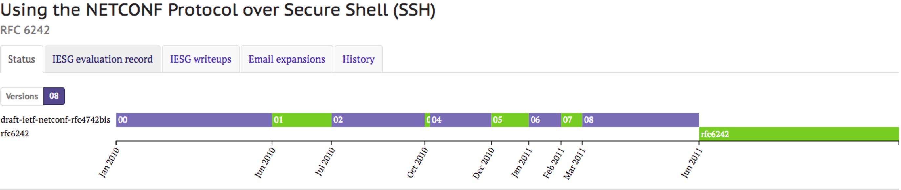

# 通过SSH使用NETCONF协议

本文主要内容都来自于2011年6月发布的[RFC 6242 - Using the NETCONF Protocol over Secure Shell (SSH)](https://tools.ietf.org/html/rfc6242)，该RFC从2010年1月提出到最终发布一共修改了8个版本，其间修改内容可以[点击查看详细内容](https://datatracker.ietf.org/doc/rfc6242/)。该文档最后更新时间是2015年4月，主要用来替换[RFC 4742 - Using the NETCONF Configuration Protocol over Secure SHell (SSH)](https://tools.ietf.org/html/rfc4742)
