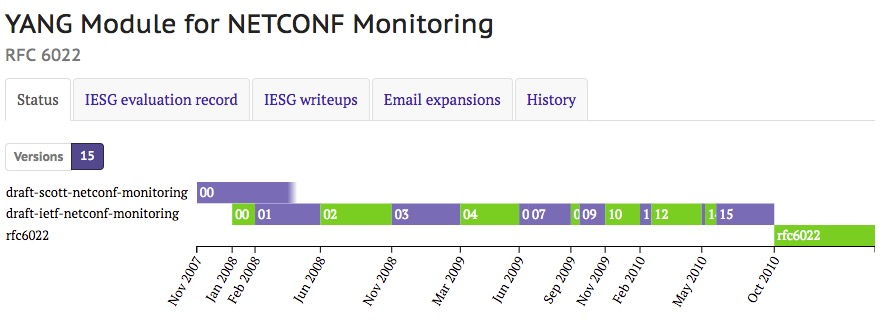

# YANG Module for NETCONF Monitoring


本文主要内容都来自于2010年10月发布的[RFC6022 -YANG Module for NETCONF Monitoring](https://tools.ietf.org/html/rfc6022)，该RFC从2007年11月提出到最终发布一共修改了15个版本，其间修改内容可以[点击查看详细内容](https://datatracker.ietf.org/doc/rfc6022/)。

## 介绍

本文档定义了一个用于监视`NETCONF`协议的`YANG` [RFC6020](https://tools.ietf.org/html/rfc6020)模型。 它提供了有关`NETCONF`会话和支持架构的信息，如[RFC4741](https://tools.ietf.org/html/rfc4741)中所定义。

诸如不同的架构格式，功能可选性和访问控制等考虑因素都会影响`NETCONF`服务器在会话设置期间发送给客户端的详细信息的适用性和级别。

本文档中定义的方法需要进一步的手段来从`NETCONF`服务器查询和检索模式和`NETCONF`状态信息。 提供这些是为了补充现有的`NETCONF`功能和操作，绝不会影响现有的行为。

还定义了一个新的`<get-schema>`操作来支持通过`NETCONF`显式的模式检索。

## NETCONF监控数据模型

本文定义的NETCONF监控数据模型提供了`NETCONF`服务器的操作信息。 这包括特定于`NETCONF`协议的细节（例如，特定于协议的计数器，诸如“`in-sessions`”）以及与模式检索（例如，`schema list`）有关的数据。

实现本文档定义的数据模型的服务器（“`urn:ietf:params:xml:ns:yang:ietf-netconf-monitoring`”）务必按照[RFC6020](https://tools.ietf.org/html/rfc6020)中的描述告知`capability URI`。

本节概述了监控数据模型。 有关详细说明，请参阅本文档中提供的规范的[YANG模块（请参阅第5节）](https://tools.ietf.org/html/rfc6022#section-5)。

### `/netconf-state`子树

`netconf-state`容器是监视数据模型的根。

```
netconf-state
    /capabilities
    /datastores
    /schemas
    /sessions
    /statistics
```

- 功能(`capabilities`)
       服务器支持的`NETCONF`功能列表。
- 数据存储(`datastores`)
       此设备上支持的`NETCONF`配置数据存储列表（例如，运行，启动，候选）以及相关信息。
- 模式(`schemas`)
       服务器上支持的模式列表。 包括识别模式和支持其检索所需的所有信息。
- 会话(`sessions`)
       设备上所有活动的NETCONF会话列表。 包括所有`NETCONF`会话的每个会话计数器。
- 统计(`statistics`)
       包括`NETCONF`服务器的全局计数器。

#### `/netconf-state/capabilities`子树

`/netconf-state/capabilities`子树包含`NETCONF`服务器支持的功能。

该列表必须包括在会话建立期间交换的所有能力，在请求时仍然适用。

#### `/netconf-state/datastores`子树

`/netconf-state/datastores`子树包含`NETCONF`服务器的可用数据存储列表，并包含有关其锁定状态的信息。

```
datastore
    /name
    /locks
```

- 名称(`name`)（`leaf`，`netconf-datastore-type`）
       支持枚举的数据存储; `candidate`, `running`, `startup。`

- 锁(`locks`)(`grouping`, `lock-info`)
        数据存储的锁列表。 信息提供全局和部分锁定[RFC5717](https://tools.ietf.org/html/rfc5717)。
        对于部分锁定，将返回锁定节点列表和最初用于请求锁定的选择表达式。

#### `/netconf-state/schemas`子树

`NETCONF`服务器支持的模式列表。

```
schema
       /identifier   (key)
       /version      (key)
       /format       (key)
       /namespace
       /location
```

network elements的`identifier`，`version`和`format`在模式列表中用作关键字。 这些用在`<get-schema>`操作中。

- `identifier (string)`
    模式列表条目的标识符。 该标识符在`<get-schema>`操作中使用，可用于其他方式，如文件检索。
- `version (string)`
    支持的模式的版本。 一个`NETCONF`服务器可以同时支持多个版本。 每个版本必须在模式列表中单独报告，即具有相同的标识符，可能不同的位置，但是不同的版本。

    对于`YANG`数据模型，版本是模块或子模块中最新的`YANG`'`revision`'语句的值，或者如果不存在'`revision`'语句，则为空字符串。
- `format (identifyref, schema-format)`
    标识是使用什么格式的数据建模语言模式来描述该`schema`。 可以使用“`xsd`”，“`yang`”，“`yin`”，“`rng`”和“`rnc`”这些格式来描述（见[第5节](https://tools.ietf.org/html/rfc6022#section-5)）。
- `namespace (inet:uri)`
    由模式定义的可扩展标记语言（`XML`）名称空间[XML-NAMES](https://tools.ietf.org/html/rfc6022#ref-XML-NAMES)。
- `location (union: enum, inet:uri)`
    一个或多个可从中检索特定模式的位置。 该列表应该每个模式至少包含一个条目。

#### `/netconf-state/sessions`子树

包括`NETCONF`管理会话的会话特定数据。 会话列表必须包含所有当前活动的`NETCONF`会话。

```
session
       /session-id (key)
       /transport
       /username
       /source-host
       /login-time
       /in-rpcs
       /in-bad-rpcs
       /out-rpc-errors
       /out-notifications
```

- `session-id (uint32, 1..max)`
    会话的唯一标识符。 该值是[RFC4741](https://tools.ietf.org/html/rfc4741)中定义的`NETCONF`会话标识符。
- `transport (identityref, transport)`
    标识每个会话的传输。 本文档定义了“`netconf-ssh`”，“`netconf-soap-over-beep`”，“`netconf-soap-over-https`”，“`netconf-beep`”和“`netconf-tls`”（见[第5节](https://tools.ietf.org/html/rfc6022#section-5)）。
-
