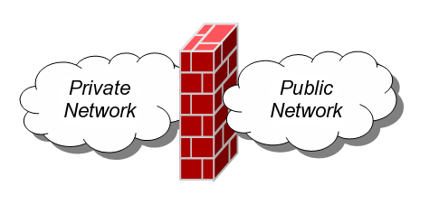
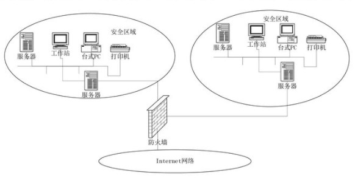
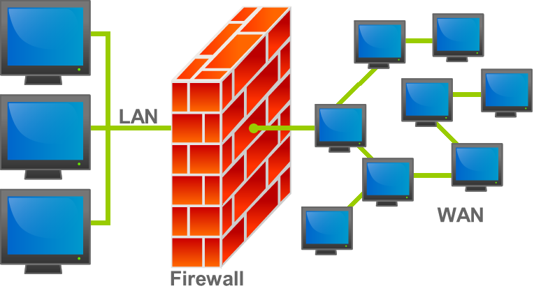

# 防火墙（`Firewall`）介绍

## 来源

防火墙的本义，是指古代构筑和使用木制结构房屋时，为防止火灾发生及蔓延，人们将坚固石块堆砌在房屋周围做为屏障，这种防护结构建筑就被称为防火墙。

现代网络时代引用此喻意，指隔离本地网络与外界网络或是局域网间与互联网或互联网的一道防御系统，借由控制过滤限制消息来保护内部网络数据的安全。

## 基础定义

传统意义上，防火墙（`Firewall`）是一个架设在互联网与企业内网之间的信息安全系统，根据企业预定的策略来监控往来的传输。

防火墙可能是一台专属的网络设备或是运行于主机上来检查各个网络接口上的网络传输。

防火墙是目前最重要的一种网络防护设备，从专业角度来说，防火墙是位于两个(或多个)网络间，实行网络间访问或控制的一组组件集合之硬件或软件。

## 功能

防火墙最基本的功能就是隔离网络，通过将网络划分成不同的区域（通常情况下称为`ZONE`），制定出不同区域之间的[访问控制](#access_control)策略来控制不同信任程度区域间传送的数据流。以避免安全策略中禁止的一些通信。它有控制信息基本的任务在不同信任的区域。

> 例如互联网是不可信任的区域，而内部网络是高度信任的区域。

典型信任的区域包括互联网(一个没有信任的区域) 和一个内部网络(一个高信任的区域) 。

根据不同的需要，防火墙的功能有比较大的差异，但是一般都包含以下三种**基本功能**：

- 可以限制未授权的用户进入内部网络，过滤掉不安全的服务和非法用户
- 防止入侵者解决网络防御设施
- 限制内部用户访问特殊站点

## 目标

防火墙具有三个目标：

- 从外部到内部和从内部到外部的所有流量都通过防火墙。
- 仅被授权的流量（由安全策略定义）允许通过。
- 防火墙自身免于渗透。

### 最终目标

总结来说，防火墙的最终目标是**根据模型之间最少特权原则，提供受控连通性在不同水平的信任区域通过安全政策的运行和连通性**。

>例如，`TCP/IP Port` 135~139是 Microsoft Windows 的【网上邻居】所使用的。如果电脑有使用【网上邻居】的【共享文件夹】，又没使用任何防火墙相关的防护措施的话，就等于把自己的【共享文件夹】公开到Internet，供不特定的任何人有机会浏览目录内的文件。

## 局限性

 没有万能的网络安全技术，防火墙也不例外。防火墙主要有以下三方面的局限。

 - 防火墙不能防范网络内部的攻击。比如：防火墙无法禁止内部人员将敏感数据拷贝到自己的存储介质上
 - 防火墙也不能防范哪些伪装成超级用户或诈称新员工的黑客们劝说没有防范心理的用户公开其口令，并授予其临时的网络访问权限。
 - 防火墙不能防止传送已感染病毒的软件或文件，不能期望防火墙对每一个文件进行扫描，查出潜在的病毒。

## 类型

### 代理防火墙

代理防火墙是一种早期的防火墙设备类型，它针对特定应用充当从一个网络到另一个网络的网关。

代理服务器可以通过阻止来自网络外部的直接连接来提供其他功能（例如内容缓存和安全性）。 但是，这可能会影响设备的吞吐量以及它们所能支持的应用。

### 状态检测防火墙

目前，状态检测防火墙普遍被视为“传统”防火墙，这种防火墙根据状态、端口和协议来允许或阻止流量。

它负责监控从连接打开到连接关闭期间的所有活动。 过滤决策以管理员定义的规则以及情景为依据（情景是指以前的连接以及属于该连接的数据包的使用信息）。

### 统一威胁管理 (UTM) 防火墙

`UTM` 设备通常以一种松散耦合的方式，将状态检测防火墙的功能与入侵防御和防病毒功能结合到一起。

这类防火墙也可能包含其他服务，而且通常会包含云管理功能。 `UTM` 主要侧重于简单性和易用性。

### 下一代防火墙 (NGFW)

如今，防火墙经过演变，已不再单纯提供数据包过滤和状态检测功能。 大多数公司都在部署下一代防火墙，以求阻止高级恶意软件攻击和应用层攻击等现代威胁。

根据 **Gartner** 公司的定义，下一代防火墙必须包括以下要素：

- 标准防火墙功能（如状态检测）
- 集成入侵防御功能
- 应用感知和控制功能（可查看和阻止存在风险的应用）
- 能够吸纳未来出现的信息源的升级途径
- 能够应对不断演变的安全威胁的方法

这些功能已逐渐被大多数公司奉为标准，但实际上，下一代防火墙还可以提供更多功能。

### 专注于威胁的下一代防火墙

这类防火墙不仅包含常规下一代防火墙的所有功能，而且具备高级威胁检测和补救能力。 利用专注于威胁的下一代防火墙，您可以：

- 借助全面的情景感知能力，了解哪些资产面临最高的风险
- 借助能够动态设置策略并加强防御的智能安全自动化功能，快速应对各种攻击
- 通过关联网络时间和终端事件，更好地发现逃避检测的活动或可疑活动
- 借助在初始检测后仍持续监控可疑活动和可疑行为的追溯性安全功能，极大地缩短从发现威胁到清除威胁的时间
- 借助涵盖整个攻击过程的统一策略，实现轻松管理并降低复杂性

## 解释

- <a id="access_control">访问控制</a> ： 在信息安全领域中，访问控制包含了认证、授权以及审核。

## 参考

- [维基百科-防火墙](https://zh.wikipedia.org/wiki/%E9%98%B2%E7%81%AB%E5%A2%99)
- [Cisco-防火墙是什么](https://www.cisco.com/c/zh_cn/products/security/firewalls/what-is-a-firewall.html)
- [ConnnetOS-Firewall配置](http://my-doc.readthedocs.io/en/latest/cfg/qos/firewall_configuration.html)
