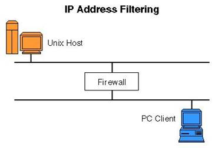

# 防火墙工作原理

防火墙的基本工作原理就是起到`Filter`(过滤筛)的作用。你可以让你喜欢的东西通过这个过滤筛，别的东西统统过滤掉。

在网络的世界里，由防火墙过滤的就是承载通信数据的通信包。

## IP Address Filtering

所有的防火墙都有`IP`地址过滤功能。这个任务主要是检查`IP`包头，根据其IP源地址和目标地址做出`放行/丢弃`的决定。

## 附录

- [防火墙的工作原理概述](http://www.nowamagic.net/academy/detail/72150512)
