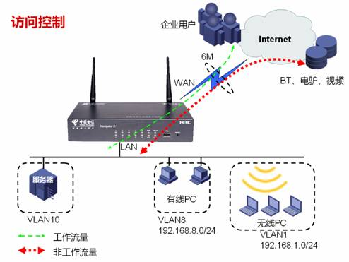
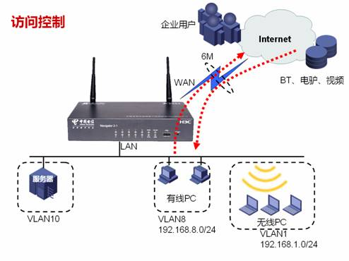
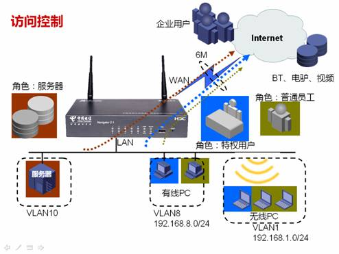
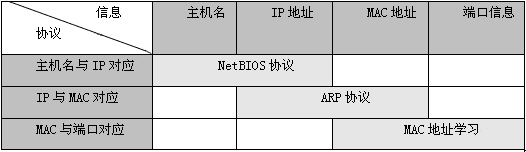

# ICG(Internet Control Gateway)简介

## 自由互联和应用控制

在网络带宽有限的环境下，带宽就变成一项很重要的资源，那么对于一个企业而言，有限的带宽如果被一些非工作流量所占据，而工作流量却因为带宽不够受到影响，这无疑是一件很糟糕的事情。今天我们就来讨论一下互联网访问控制。

为何事情会发展到如此地步呢？在互联网方兴未艾的时候根本就没人提要控制应用，提倡的都是自由互联，这是因为当互联网刚刚萌芽的时候，受到接入技术限制（以56K Modem为主），互联网上的应用基本上以静态的文本网页或者少量的图片为主，当时互联网是以吸引用户数为目的的，运营商则是通过提供接入服务数量为盈利点的。

随着互联网接入技术的革新（面向电话线路的xDSL和面向以太网的FTTx技术），用户数量的迅速膨胀，互联网应用开始井喷了，有人在互联网上发明了榨干每一滴带宽的P2P技术，有人则依赖高速带宽进行VPN互联或者企业信息发布，对于一般企业而言，后者能带来盈利，所以在一个有限的带宽上，必然要对类P2P技术进行限制，这就是互联网访问控制催生的重要原因。

## 基于网段的限速

基于网段的限速是比较简单的，其原理在于对某一个网段每个IP地址进行平均带宽控制，而不是对应用进行控制，从逻辑的角度而言，对某网段的限制必然就是对其余网段的保证。它的生效要满足如下条件：

1. WAN口出现拥塞，以太网接口通过配置接口带宽和实时流量比较判断是否拥塞；xDSL则可以通过端口协商机制判断是否拥塞。

2. 对指定地址范围段内每一个IP所占用上下行带宽都限制在固定范围内，即这些IP都能得到公平的处理，不会出现某一个IP独占许多带宽的情况。

那么这里就有疑问了，假设互联网出口带宽是4M，内部PC有20台，我要对其中的16台进行限制，我应该怎么设置上下行流量应该限制在多少呢？

这里我们就要利用到TCP基础理论知识了，P2P只是改变了传统“客户-服务器”应用模式，传输层使用的还是TCP和UDP，我们知道TCP是通过滑动窗口机制来工作的，窗口越大，每秒发送的数据就越多，默认情况下窗口是根据传输时延情况不断增大的，也就是说TCP的速率会试探性地不断增长，但是一旦发生丢包（TCP通过计时和确认机制判断是否丢包）、重传或乱序，窗口都会以每次减半的方式缩小，所以TCP一旦出现丢包、重传、乱序是非常影响速率的，并且网络限速通常是随机为丢弃方式，当到流量到达门限时丢包、重传、乱序的概率增大，窗口会迅速缩小，达到明显限速效果。那么UDP呢？UDP是一种发送后不管的传输协议，无法判断是否丢包，发送成功与否完全取决于应用层的实现，所以一般基于UDP的应用程序处于实现简单的原因，发送数据都不会很快，属于一种慢速传输技术。

基于对互联网应用和TCP理论的分析，针对目前互联网广泛使用应用进行试验，配置如下数值效果可以适配各种带宽情况，既能保证受限PC普通上网业务，又能避免他们滥用带宽，而不是采用平均速率（如4M带宽，内部20台PC，那么每台PC均享200k带宽）：

1. 下行1024Kbps，即1M带宽，通过各下载工具显示带宽大概在每秒100K字节（Byte）左右

2. 上行512Kbps，即0.5M带宽

3. 根据实际链路情况也可以将此数值放大1倍或缩小1半

4. 如果是高级网管人员，也可以自行设置数值

在这种情况下所有被限制的IP在网络拥塞情况下带宽都无法逾越这两个数值，比如在上图中，针对VLAN8的192.168.8.0/24和VLAN1的192.168.1.0/24进行限速，那么可以发现那些使用BT下载或看视频的PC，打开网页速度就很慢，根据用户心理，他也许会关闭BT以保证网页可以浏览。在VLAN8和VLAN1被限制的同时，VLAN9不受限制，各项应用运转顺畅。

基于网段的限速要求提前把PC根据应用类型划分成不同的连续网段，这样有利于配置，比如上图就将需要受限的普通员工PC划分到VLAN8和VLAN1中，而服务器和主管使用PC则放入到不受限的VLAN9中。

## 基于角色的流量审计和应用控制

之前我们介绍的是比较简单的互联网控制策略，在拥塞发生时，对指定IP地址进行均等限速。随着网络应用丰富多样，用户产生了更加灵活的需求，对互联网控制策略也产生了基于用户角色进行控制和管理的理念，在桌面级网络设备领域，该理念已经被越来越多厂家所接受：

1. 内部用户将不再单纯根据连续网段区分，而是全面地通过主机名、IP地址、MAC地址、物理端口号灵活地确定一台内部主机的身份。但是真正在互联网访问控制中生效的主要还是IP地址，附加信息的作用是使用户能够更直观地掌握内部主机和IP地址的对应关系。

2. 预定义不同的角色，为每个角色制定不同的控制策略，比如普通用户不允许使用QQ、MSN、BT、电驴等工具，不允许访问开心网、优酷等视频网站；服务器用户只允许开放服务，不允许发起任何访问，对于开放服务流量进行带宽保证；特权用户不作任何限制，同时保证带宽。

3. 将不同的内部用户赋予不同的角色，因此互联网行为受到相应角色所控制。

4. 同时实时流量的审计，有助于网管人员能够及时了解各内网PC的应用动态，为每种角色接受哪些控制策略做好准备。

### 基于用户角色的应用控制主要有两大类技术：

1. 第一类是用户的识别，只有将用户识别后才能对用户分配角色，标识用户的信息包括主机名、IP地址、MAC地址、端口等信息，而实际上在WAN口真正生效的是IP地址，因为在IP网络中只有IP地址能够代表一个主机，引进主机名、MAC地址和端口等信息能够更直观地展现内部主机的信息，使普通用户也能对内部主机做到验明正身，是一种易用性的体现。下表展示了各协议或技术将这不同信息绑定在一起标识内部用户的：

2. 第二类是应用的识别，只有识别了应用才能正确的限制动作，现在互联网很多应用，如BT、QQ、炒股软件等都无法用传统的地址+端口来识别，这些应用使用的端口是动态的，必须使用特殊技术对应用层数据进行分析，这项技术被称为应用程序特征库，有点类似于杀毒软件的病毒库，应用程序特征库也需要持续更新以跟踪应用程序的变化，但往往滞后于应用程序的更新进度，因为特征库必须等到应用程序发布后才能进行分析更新，此外还有一个困难是很多软件如BT会对特征库进行加密，加密后的数据包就无法被特征库所识别了，俗话说道高一尺魔高一丈，加密是需要协商的，而协商过程是存在明文阶段的，因此可以在协商阶段进行识别，所以很多时候启用应用程序限制后，已经下载的BT和已经登录的QQ依然可以使用，新增的下载任务和新登录QQ才会失败，由于大部分用户的BT和QQ都存在上上下下的过程，这种限制在实际环境的作用还是相当明显的；当然在应用识别中传统的地址+端口也保留下来，再新增一些URL过滤，基本上对各种网络应用达到比较完整的覆盖，可以说80%的网络流量都可以识别出来。

## 基于用户角色的应用控制实现原理

将上述涉及的几个技术要点结合起来，基于用户角色的应用控制实现原理可以用下面这张图来表示：

