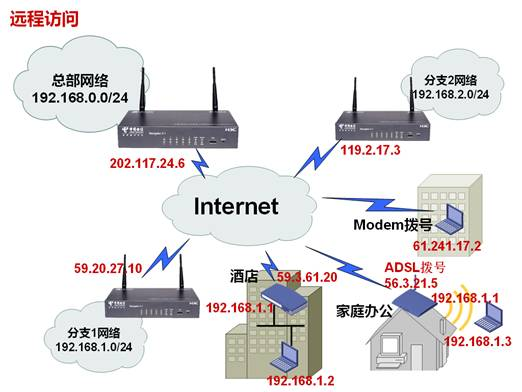
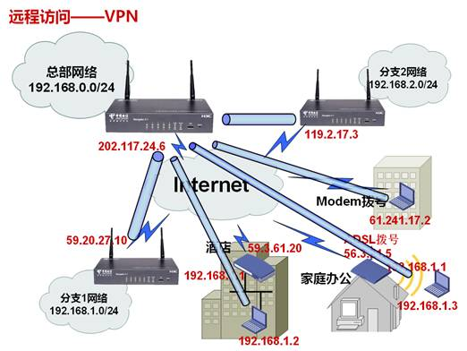
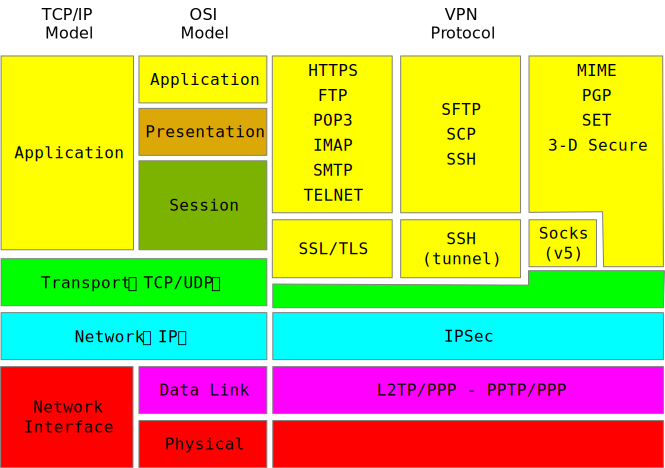
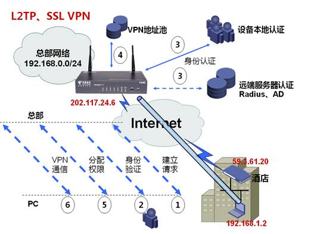
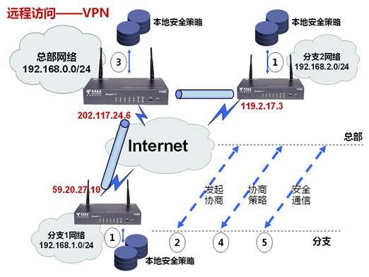

# VPN概述

## 为什么需要VPN

很多企业随着业务的发展，已经在异地建立分支机构，或者许多员工出差至外地开展工作，甚至需要回家继续办公，那么这些远程员工是否还能够连接到总部网络享受到统一的企业信息化管理呢？我想，大家必定会回答可以，既然可以，是通过什么技术实现的呢？或者说实现的时候要考虑哪些因素呢？从上面的图中我们可以看到似乎有很多种异地网络用户，布置这种技术似乎很困难，我们先把图中网络单元可以分为3类：

1. 总部机构，总部在连接互联网绝大多数情况下使用固定出口以及固定地址，在一些极端情况下可能会采用动态地址方式。

2. 远程分支机构，这类网络有固定的网络出口连接到互联网，互联网出口设备以及内部网络都是完全受企业管理的，在图中，分支1和分支2都是这类，虽然网络出口是固定的，但是出口地址是否固定和接入方式有关，比如租用光纤那么通常会从运营商获得一个固定地址，如果是ADSL则是动态的，远程分支机构的典型特征是以一个网络作为远程接入单位。

3. 出差员工，这类网络用户的特点是以用户PC为远程网络单元，为什么呢，因为这类用户的互联网出口通常不受企业管理，比如出差员工在酒店通过酒店网络接入互联网、员工在家上网、员工在酒店直接拨号到互联网等，这类用户的特征是以单台PC作为远程接入单位。

这些异地网络用户访问总部网络，可能大家会认为很简单，直接访问总部网络的网段就可以了。实际上，企业网络通常使用私有地址，是无法从互联网直接访问的，那么我们可以通过什么手段访问这些总部的私有网段吗？

1. 使用专线，即每个异地网络用户单元使用一条专线连接到总部，那么在上图中，我们至少需要5条专线，如果出差员工或者分支多起来需要更多专线，每条专线都价值不菲，而且专线只能连接总部，无法访问互联网，显然这种方式对于非常注重成本的企业而言是不可接受的。

2. 既然总部和各个异地网络都连接到了互联网，能不能通过互联网把大家连起来呢？我们可以看到各个网络单元的出口都是互联网公有地址，让这些地址互相访问不成问题，那么能不能把访问内部私有网络的连接建立在这些共有连接上呢？答案当然可以，这就是今天要讲的内容——虚拟私有网（`Virtual Private Network`），即在公共网络上建立虚拟的隧道，模拟成专线。

## VPN应用场景和隧道特点

那么如何建立这些隧道呢？要建立什么样的隧道？我们可以通过这张表来描述异地网络用户和总部网络出口隧道的特点。

|      | 隧道端点     | 隧道内流量     | 隧道发起     | 安全性需求     | 是否穿越NAT     |
| :------------- | :------------- | :------------- | :------------- | :------------- | :------------- |
| 异地分支 | 分支出口<->总部出口 | 分支内网<->总部内网 | 总部和分支都可以发起 |少量身份认证和加密 |不需要 |
| 酒店、家庭办公 | 异地PC<->总部出口 | 异地PC<->总部内网 | 只能从PC发起 | 大量动态身份认证和加密 | 需要 |
| 异地分支 | 异地PC<->总部出口 | 异地PC<->总部内网 | 只能从PC发起 | 大量动态身份认证和加密 |不需要 |

## VPN基本功能

VPN属于远程访问技术，简单地说就是利用公用网络架设专用网络。例如某公司员工出差到外地，他想访问企业内网的服务器资源，这种访问就属于远程访问。

在传统的企业网络配置中，要进行远程访问，传统的方法是租用DDN（数字数据网）专线或帧中继，这样的通讯方案必然导致高昂的网络通讯和维护费用。对于移动用户（移动办公人员）与远端个人用户而言，一般会通过拨号线路（Internet）进入企业的局域网，但这样必然带来安全上的隐患。

让外地员工访问到内网资源，利用VPN的解决方法就是在内网中架设一台VPN服务器。外地员工在当地连上互联网后，通过互联网连接VPN服务器，然后通过VPN服务器进入企业内网。为了保证数据安全，VPN服务器和客户机之间的通讯数据都进行了加密处理。有了数据加密，就可以认为数据是在一条专用的数据链路上进行安全传输，就如同专门架设了一个专用网络一样，但实际上VPN使用的是互联网上的公用链路，因此VPN称为虚拟专用网络，其实质上就是利用加密技术在公网上封装出一个数据通讯隧道。有了VPN技术，用户无论是在外地出差还是在家中办公，只要能上互联网就能利用VPN访问内网资源，这就是VPN在企业中应用得如此广泛的原因。

## VPN分类标准

根据不同的划分标准，VPN可以按几个标准进行分类划分：

### 1. 按VPN的协议分类：

VPN的隧道协议主要有四种，[PPTP](https://en.wikipedia.org/wiki/Point-to-Point_Tunneling_Protocol)、[L2TP](https://en.wikipedia.org/wiki/Layer_2_Tunneling_Protocol)、[IPSec](https://en.wikipedia.org/wiki/IPsec)和[SSL](https://en.wikipedia.org/wiki/Transport_Layer_Security)，其中`PPTP`和`L2TP`协议工作在OSI模型的第二层，又称为二层隧道协议；`IPSec`是第三层隧道协议；而`SSL`是工作在OSI会话层之上的协议，如果按照TCP/IP协议模型划分，即工作在应用层。

### 2. 按VPN的应用分类：

1. `Access VPN`（远程接入VPN）：客户端到网关，使用公网作为骨干网在设备之间传输VPN数据流量；
1. `Intranet VPN`（内联网VPN）：网关到网关，通过公司的网络架构连接来自同公司的资源；
1. `Extranet VPN`（外联网VPN）：与合作伙伴企业网构成Extranet，将一个公司与另一个公司的资源进行连接。

### 3. 按所用的设备类型进行分类：

网络设备提供商针对不同客户的需求，开发出不同的VPN网络设备，主要为交换机、路由器和防火墙：

1. 路由器式VPN：路由器式VPN部署较容易，只要在路由器上添加VPN服务即可；
1. 交换机式VPN：主要应用于连接用户较少的VPN网络；
1. 防火墙式VPN：防火墙式VPN是最常见的一种VPN的实现方式，许多厂商都提供这种配置类型

### 4. 按照实现原理划分：

1. 重叠VPN：此VPN需要用户自己建立端节点之间的VPN链路，主要包括：GRE、L2TP、IPSec等众多技术。
1. 对等VPN：由网络运营商在主干网上完成VPN通道的建立，主要包括MPLS、VPN技术。

## VPN技术介绍

我们可以从上表中发现异地分支和总部、异地PC和总部之间隧道有较多不同，可以把VPN划分为这两类场景进行研究，有什么样的需求就有什么样的技术：

1. PPTP（点到点隧道协议）、L2TP（二层隧道协议）、SSL VPN（安全会话层VPN）：这两个技术主要用于异地PC向总部方向建立VPN，但PPTP、L2TP不支持加密（PPTP的兼容性没有L2TP好），SSL VPN则必须要求加密；这三类技术都有很灵活的动态身份认证机制，SSL VPN不但拥有灵活安全的认证机制，在用户角色权限控制上具备极强的扩展性，因此这3类技术非常适合远程PC拨号接入场景，随着SSL VPN技术成熟，部署成本下降，正在不断地侵占L2TP原有市场。

2. IPSec：通用性最强的VPN安全技术，能够适应异地分支和总部互联，也适用于异地PC向总部发起连接；可以单独使用，也可以和L2TP结合，保证L2TP的安全，但是IPSec的动态身份认证功能较弱，不太适用于大量动态用户拨号的场景，比较适合接入数量相对稳定的场景，此外IPSec功能复杂，PC上通常是通过各厂家专用客户端实现，因此IPSec技术更适合异地分支和总部网络互连的场景。

3. SSL VPN是以HTTPS（Secure HTTP，安全的HTTP，即支持SSL的HTTP协议）为基础的VPN技术，工作在传输层和应用层之间。**SSL VPN充分利用了SSL协议提供的基于证书的身份认证、数据加密和消息完整性验证机制，可以为应用层之间的通信建立安全连接**。SSL VPN广泛应用于基于Web的远程安全接入，为用户远程访问公司内部网络提供了安全保证。

下面对集中VPN技术和应用场景进行详细介绍。由于PPTP功能和L2TP重叠，且应用较窄，在此文中不作介绍。

### L2TP和SSLVPN

该类型的VPN可以分为如下几个阶段：

1. 分支向总部发出连接请求，要就建立VPN，如果是SSL VPN，该阶段还需要协商密钥，为后续所有通信进行加密保护，而L2TP则没有专用保护手段，除非借助IPSec的帮助。

2. 对接入请求进行身份验证，因为企业的VPN资源只允许对本企业员工开放，所以必须对接入者身份进行验证，身份验证通常分为身份确认和口令验证两部分组成，身份表明用户的角色，而口令则是进一步确认角色的准确性。

3. 身份验证可以有两种方式实现，一是本地认证，二是专用服务器认证，通常专用服务器认证能够有更好的扩展性和性能。认证的结果称之为授权，即授予一定的功能，授权内容由总部出口控制。

4. 授权中一个很重要内容是为远端PC的隧道接口分配一个属于企业内部的私有地址，表示该远端PC已经接入到企业内部网络了；地址授权依然可以由设备实现，也可以由认证服务器实现。为什么要分配地址呢？因为我们说了VPN是在互联网上模拟一条专线，物理专线需要IP地址，那么这个虚拟专线也需要IP地址。

5. 总部出口设备返回给远端PC的是认证和授权的报告，报告内容主要是通知接入者是否接入成功，如果认证失败则对PC提示接入失败，如果认证成功，则提示用户已经成功接入VPN。

6. VPN建立后，该远端PC就像是通过一个专用的线缆接入到企业出口设备上了，可以根据授权内容进行访问。

7. 这种类型的VPN连接和断开都是在外出员工在远端PC上主动操作，通常总部出口网关无法主动关闭VPN；为了避免总部出口长期没有收到拆除消息而维护大量VPN连接导致资源耗尽，VPN连接通常都是有计时机制的，如果总部出口设备长时间没有收到远端PC的任何VPN流量，那么总部出口会认为该PC已经下线，释放资源，这是很重要的安全考虑。

### IPSec VPN

在IPSec中，由于总部网络相对固定，而分支变动性较大，所以大部分情况下是也是由分支向总部发起连接：

1. IPSec协商并不需要像L2TP、SSL VPN那样需要每次人为主动去建立连接，IPSec需要通信双方提前做好配置，我们通常称这些配置为安全策略，主要内容包括远端地址、兴趣流、远端身份信息和预共享密钥（也可以采用数字证书）、阶段1安全提议、阶段2安全提议等，将本地安全策略制定好后，IPSec VPN就会根据兴趣流自动触发建立，因此特别适合分支网络和总部网络通信的场景。

2. 当分支检测到兴趣流后，就会根据安全策略配置向总部发起阶段1协商，在协商时需要同样需要进行验证，验证失败则退出协商，除了验证身份外还需要对阶段1安全参数进行协商，如果协商不出共同的安全参数，那么也是退出协商。

3. 总部通常处于被动响应模式，所以当需要协商时，也是从本地安全策略中找出匹配的参数。

4. 如果阶段1安全参数和验证成功，会进行2阶段的协商，阶段2协商的是兴趣流和阶段2安全参数，如果能够找到相匹配的参数，则协商成功，如果协商失败则有可能同时把阶段1协商结果删除。

5. 阶段2协商成功后，分支和总部就建立了安全隧道，可以正常的通信了。

6. IPSec默认周期性协商机制，如果下一周期协商失败，那么隧道拆除；此外还有对端激活检测，如果检测对端已经失效则自动拆除隧道。

### 不同VPN实现对比

|      | L2TP | SSL VPN | IPSec |
| :------------- | :------------- | :------------- | :------------- |
| 发起方      | 远端PC | 远端PC | 总部、分支、远端PC |
| 身份验证| 基于PPP认证 | 用户名+口令+证书 | 地址或名字+口令或证书 |
|加密保证|无|有|有|
|地址分配|有|有|无|
|客户端|XP自带或第三方|免安装式浏览器插件|通常为厂家设备内部实现，PC使用厂家专用客户端|
|兼容互通性|优良，基本上各个厂家都兼容XP客户端|PC使用浏览器打开VPN，与浏览器相关|优良，已经达到工业化标准成都，大部分厂家能够互通|
|资源消耗|轻|重|中|
|性能加速|无|加密卡硬件加速|加密卡硬件加速|
|隧道穿越NAT|可以|可以|可以|

从上表可以看出，L2TP和SSL VPN确实更适合远端PC，特别是SSL VPN就是专门为远端PC开发的VPN技术。而IPSec更适合在分支和总部之间搭建VPN隧道。

## 参考
1. [PPTP(Point to Point Tunneling Protocol)](https://en.wikipedia.org/wiki/Point-to-Point_Tunneling_Protocol)
1. [L2TP(Layer 2 Tunneling Protocol)](https://en.wikipedia.org/wiki/Layer_2_Tunneling_Protocol)
1. [IPSec](https://en.wikipedia.org/wiki/IPsec)
1. [SSL/TLS(Secure Sockets Layer / Transport Layer Security)](https://en.wikipedia.org/wiki/Transport_Layer_Security)
1. [Client/Serveur SSL/TLS multiplateformes avec OpenSSL](https://www.asafety.fr/projects-and-tools/c-client-serveur-ssl-tls-multiplateformes-avec-openssl/)
1. [OSI 7 LAYER MODEL](http://www.escotal.com/osilayer.html)
