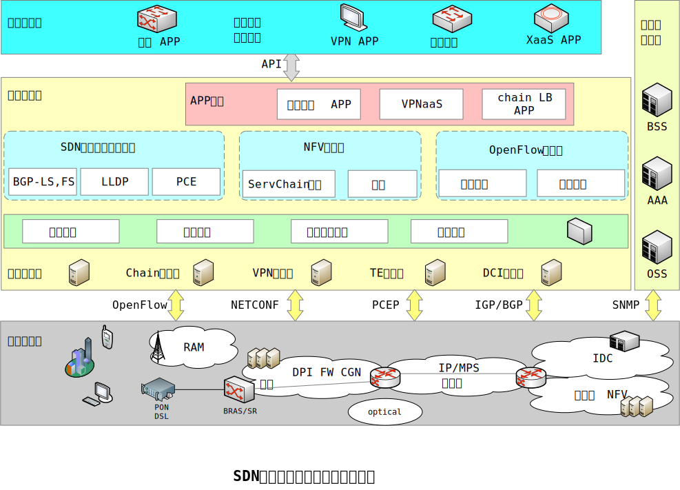

# SDN控制器应用场景

## 场景描述

广义的SDN技术门类非常丰富，可以广泛应用于电信运营商的不同网络层次和业务领域，相关场景包括：

传输网中的：
- 光路自动适配
- 光网络可视化
- IP/传输资源协同等相关业务
- IP骨干/城域网中的流量工程
- 个人/VPN流量差异化承载
- 虚拟化BNG
- ...相关业务

移动网络中的：
- IP RAN资源调度
- 虚拟EPC网元
- Gi-LAN
- ...相关业务

接入网中的：
- WLAN资源调度
- 虚拟化家庭网络
- 虚拟化家庭网关
- ...相关业务

IDC网络中的：
- 虚拟化资源优化
- 网络优化
- DCI
- ...相关业务

> 由于这些专业网络与业务领域需要的控制功能和控制逻辑差异巨大，因此，上述领域的控制器大多应该独立设计并独立管理各自的网元设备。

从SDN控制器的设计角度来看，依照当前SDN进展和技术分类状况，SDN控制器的应用场景可以分为3类：
- SDN过渡技术控制平面
- NFV控制平面
- OpenFlow控制平面

### SDN过渡技术控制平面

基于传统路由协议的扩展或改进，无需新增任何新型设备，通过分离和公开控制平面、增加网络资源可视化能力的方式，实现SDN承载与控制分离的思路。

具体场景包括：
- 基于各类BGP扩展协议的骨干/城域网集中式流量优化调度
- DCI流量流向优化
- IP RAN与WLAN资源优化等

控制器需要实现 **资源可视化**、**资源调度算法**、**路由计算**、**业务API** 等功能。

### NFV控制平面

为NFV设施提供一个公共的控制器，提供全局的资源优化分配能力。

具体场景包括
- 基于x86服务器的vEPC、vBRAS、vCPE等设备的集中控制器

控制器需要完成 **流量分类**、**路由**、**拓扑发现**、**资源调度** 等功能。

### OpenFlow控制平面

在职场OpenFlow协议的全新网络、OpenFlow与传统网络叠加的混合网络中，通过集中控制器提供更为灵活的调度能力。

控制器需要提供OpenFlow交换机所需要的 **流表存储与管理**、**用户级业务控制**、**资源拓扑**、**资源优化调度** 以及 **packet-in** 等功能。

### SDN在传统网络中的应用架构

> 为了实现对网络及其业务的智能控制，实现“智能管道”能力，于是将运营商广域网分为**网络设施层**、**承载控制层**、**业务控制层** 3层，并对相对功能进行了重新划分和解耦

在实际应用过程中，SDN控制器需要连接运营支持系统、业务编排器、南向的网元设定3类系统，并开发大量接口，才能完成对承载网络和业务的全面控制。
